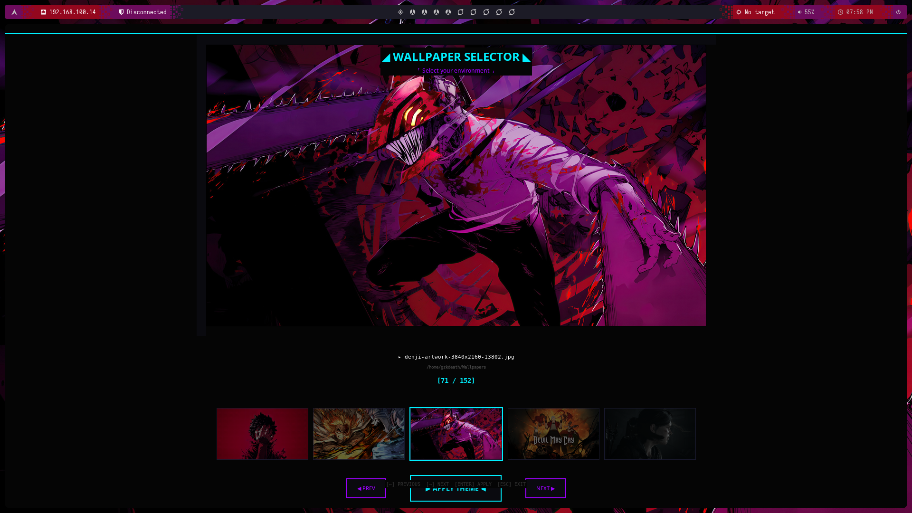

# ⛓️🖤 Gothic Wallpaper Selector 🥀⚰️

<p align="center">
  
</p>

<p align="center">
  <b>🦇 Selector de wallpapers oscuro con aesthetic gótico para bspwm ⚰️</b>
</p>

<p align="center">
  
  
  
  
</p>

---

## 🕯️⛓️ Características

| Feature | Descripción |
|---------|-------------|
| 🖤 **Interfaz Oscura** | Diseño gótico con sombras y acentos sangre |
| 🩸 **Integración Pywal** | Extrae colores oscuros del wallpaper seleccionado |
| ⚡ **Rendimiento Óptimo** | Carga lazy de imágenes para respuesta instantánea |
| ⌨️ **Atajos de Teclado** | Navegación rápida con flechas y teclas |
| 🖥️ **Pantalla Completa** | Interfaz inmersiva en tinieblas |
| 🔒 **Single Instance** | Evita múltiples ventanas simultáneas |
| 🖼️ **158+ Wallpapers** | Colección oscura incluida |

---

## 📸 Preview

<p align="center">
  
</p>

---

## 🗝️🛠️ Requisitos

### 🔒 Dependencias del Sistema

**🐉 Kali Linux / Debian / Ubuntu:**
```bash
sudo apt update
sudo apt install python3 python3-pip python3-tk python3-pil python3-pil.imagetk feh
```

**🦅 Arch Linux:**
```bash
sudo pacman -Sy --noconfirm python python-pillow tk feh
```

**🎩 Fedora:**
```bash
sudo dnf install python3 python3-pillow python3-tkinter feh
```

### 🐍 Dependencias Python

```bash
pip3 install Pillow pywal
```

O instálalas desde el archivo requirements:
```bash
pip3 install -r requirements.txt
```

### ⛓️ Opcionales (para tema completo)

- 🪟 **bspwm** - Window manager (recomendado)
- 📊 **polybar** - Barra de estado (para cambio de colores)
- 🚀 **rofi** - Launcher de aplicaciones (para cambio de colores)

---

## ⚰️📦 Instalación Rápida

### 🕯️ Método 1: Instalador Automático (Recomendado)

```bash
# 1️⃣ Clonar el repositorio
git clone https://github.com/sos4boyz/cyberpunk-wallpaper-selector.git

# 2️⃣ Entrar al directorio
cd cyberpunk-wallpaper-selector

# 3️⃣ Ejecutar instalador
chmod +x install.sh
./install.sh
```

### ⚰️ Método 2: Instalación Manual

```bash
# Clonar repositorio
git clone https://github.com/sos4boyz/cyberpunk-wallpaper-selector.git
cd cyberpunk-wallpaper-selector

# Instalar dependencias
pip3 install -r requirements.txt

# Crear directorio de wallpapers
mkdir -p ~/Wallpapers

# Copiar wallpapers de ejemplo (opcional)
cp -r Wallpapers/* ~/Wallpapers/
```

---

## 🎮🕯️ Uso

### ▶️ Ejecutar el selector

```bash
python3 wallpaper-selector.py
```

### ⌨️ Atajos de Teclado

| Tecla | Acción | Icono |
|-------|--------|-------|
| `←` | Wallpaper anterior | ⬅️ |
| `→` | Wallpaper siguiente | ➡️ |
| `Enter` / `Space` | Aplicar tema | 🩸 |
| `Esc` / `Q` | Salir | 💀 |

### 🖱️ Clic en Thumbnails

También puedes hacer clic en los thumbnails de abajo para navegar rápidamente entre wallpapers.

---

## 🔗🖥️ Atajo de Teclado en bspwm

Agrega a tu `~/.config/sxhkd/sxhkdrc`:

```bash
# ⛓️ Gothic Wallpaper Selector
super + alt + w
    python3 ~/cyberpunk-wallpaper-selector/wallpaper-selector.py

# Alternativo con Super + Shift + W
super + shift + w
    python3 ~/cyberpunk-wallpaper-selector/wallpaper-selector.py
```

**Recuerda reiniciar sxhkd:**
```bash
killall sxhkd && sxhkd &
```

---

## 📁🖼️ Wallpapers Incluidos

Este repositorio incluye **158+ wallpapers** oscuros de alta calidad. Una selección de muestra está en la carpeta `Wallpapers/`.

**Para ver la lista completa:** [`wallpapers-list.txt`](wallpapers-list.txt)

**Agregar más wallpapers:**
```bash
# Copiar a tu directorio de wallpapers
cp /ruta/a/tus/wallpapers/*.jpg ~/Wallpapers/

# Formatos soportados: .jpg, .jpeg, .png, .webp, .bmp
```

---

## 🏗️📂 Estructura del Proyecto

```
📦 gothic-wallpaper-selector/
├── 🐍 wallpaper-selector.py          # Aplicación principal
├── 📜 themes                          # Script para pywal
├── 📋 requirements.txt                # Dependencias Python
├── 🔧 install.sh                      # Instalador automático
├── 🖥️ wallpaper-selector.desktop      # Entrada de escritorio
├── 📸 screenshots/                    # Capturas de pantalla
│   └── selector-preview.png
├── 🖼️ Wallpapers/                    # Colección oscura
│   ├── 1000054530.jpg
│   ├── 1042669.jpg
│   └── ...
├── 📄 wallpapers-list.txt             # Lista completa de wallpapers
├── 📄 README.md                       # Este archivo
├── 📄 LICENSE                         # Licencia MIT
└── 🚫 .gitignore                      # Ignorar archivos temporales
```

---

## 🎨✏️ Personalización

### 🌙 Cambiar Colores

Edita las variables de color en `wallpaper-selector.py`:

```python
self.bg_color = '#0a0a0a'        # ⚫ Void black
self.blood_red = '#8b0000'       # 🩸 Dark blood red
self.dark_crimson = '#4a0000'    # 🥀 Crimson shadow
self.void_purple = '#2d0a31'     # 🌙 Void purple
self.obsidian = '#1a1a1a'        # ⛓️ Obsidian gray
self.silver = '#8a8a8a'          # 🗝️ Dark silver
self.bone_white = '#c0c0c0'      # 🦴 Bone white
```

### 📏 Ajustar Tamaño de Thumbnails

```python
self.thumb_h = int(self.sh * 0.10)  # 📐 10% de la altura de pantalla
```

---

## 🔧🛠️ Solución de Problemas

### 🖤 Error: `No module named 'tkinter'`

```bash
# 🐉 Kali/Ubuntu/Debian
sudo apt install python3-tk

# 🦅 Arch
sudo pacman -S tk
```

### 🖤 Error: `No module named 'PIL'`

```bash
pip3 install Pillow
```

### 🖤 Error: `wal: command not found`

```bash
pip3 install pywal
```

### 🖤 El selector no abre

Verifica que tienes imágenes en `~/Wallpapers`:
```bash
ls ~/Wallpapers
```

Si está vacío, copia los wallpapers de ejemplo:
```bash
cp -r ~/cyberpunk-wallpaper-selector/Wallpapers/* ~/Wallpapers/
```

---

## 🤝👥 Contribuir

1. 🍴 Fork el repositorio
2. 🌿 Crea una rama (`git checkout -b feature/nueva-caracteristica`)
3. 💾 Commit tus cambios (`git commit -am '⛓️ Agrega nueva característica'`)
4. 📤 Push a la rama (`git push origin feature/nueva-caracteristica`)
5. 🔄 Abre un Pull Request

---

## 📄⚰️ Licencia

Este proyecto está licenciado bajo **MIT License** - ver el archivo [LICENSE](LICENSE) para detalles.

---

## 🙏🖤 Créditos

- 🦇 Diseño gótico inspirado en aesthetics oscuros
- 🩸 Integración con [pywal](https://github.com/dylanaraps/pywal) para extracción de colores
- ⚰️ Desarrollado para entornos **bspwm/polybar**
- ⛓️ Creado en las tinieblas por **sos4boyz**

---

<p align="center">
  <b>Desarrollado en la oscuridad con 🖤 y código</b><br>
  <i>⛓️ Gothic Wallpaper Selector v1.0 ⛓️</i>
</p>

<p align="center">
  🦇 <b>Star este repo si te gustó!</b> 🦇
</p>
